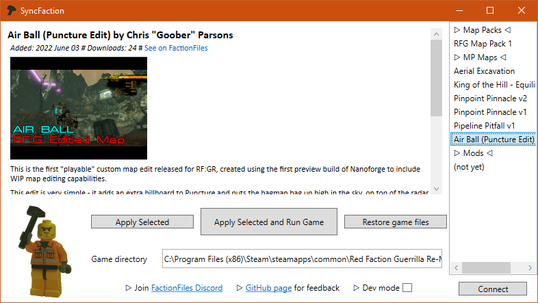

# SyncFaction

Red Faction Guerrilla mod manager with focus on user experience

*Like a multiplayer launcher for any recent game, plus mod support*

## Project goals

* Provide decent **multiplayer** experience: 1-click sync to latest game version with tonight's map pack and jump into action!
* Become ModManager successor for **singleplayer** with less bugs and more online package-management approach
* Save people from headaches (manual file management, keeping up to date with community)

## Features

* Both Steam and GOG versions are supported
* Community patch auto-update
  * Incremental updates supported
  * Patch is not released officially as of September 2022, sort of alpha version is used by community
* Backup management tries to save you from downloading game files over and over again if something got messed up
* Integration with [Faction Files](https://www.factionfiles.com/ff.php?action=files)
  * Browse, download and install mods _(only multiplayer maps for now)_
  * See news for upcoming Game Nights: _will tell you which map pack we are playing next!_
* Download progress display, cache and resume for places with bad internet

## Non-features

* Saving storage space is not a priority. Backups are created only when files are modified for the first time, but after extensive modding game folder can be 2x heavier (or more!) because every game file is stored twice
* Unpacking game archives and internal file formats for modding is done by Nanoforge and other tools

## Getting help

* Use Steam to check integrity of game files
* Check if game location is valid
* See if new versions of SyncFaction are available on Github
* Please report errors here in issues. **Copy all the stuff from application window** to help fixing it! Also describe what you were trying to do.
* Probably ping **rast1234** on FactionFiles Discord (link below)

## TODO

A lot of functionality is not implemented yet!

* button to report current state, collect log and probably list files/hashes
* sanity checks for state management, eg when resetting to vanilla (now app needs restart)
* Check discord for feature requests
* Better logging: now it's a mess of important stuff, trash and bad-formatted information
* rickroll
* COMMUNITY PATCHES MUST SUPPORT MODINFO XML
* Support mods that modify files inside vpp_pc archives as ModManager did
  * display inputs from MM
  * account for situations when modinfo.xml is inside subfolder
  * show resulting XML tree after user input
  * apply operations
    * unpack
    * edit XML contents
    * move files
    * pack
    * save/load state of selected values and custom inputs
    * SameOptionsAs must be copied before displaying
    * display list of files changed by mod (even for non-xml mods)
* compare hashes for steam and gog versions
* test what happens if cdn is unavailable
* show warnings if mod edits MP files. also show files to be modified as list
* rename community patch to terraform patch where possible
* if both .reg versions are detected, fail auto search and ask to place app in game dir
* redo fixes from hotfix branch
  * remove .exe .dll .pdb from hash checks, but not entirely or gog/steam detection will break
  * ??? check hotfix branch carefully for other stuff

## Tech info

Built using `dotnet 6`. UI is using WPF, core functionality is separated to a class library. Currently tied to Windows because of WPF and Registry (used to find game installation). Linux port only requires another UI or CLI.

Release is always single-file .exe with only dependency on dotnet framework installed (will ask to download if not).

All settings, cache, backups and downloads are stored inside `<game_dir>/.syncfaction`. Folder can be removed at any time.

## Credits

Implemented with support from **moneyl, Camo, Goober, natalie, ATMLVE** and others from FactionFiles community. You people are awesome, bringing life to my favourite game! <3

([join Discord!](https://discord.gg/factionfiles))

## Short-term plan 

Or how to get this branch closer to release and not burn out:

0. XML merging features
  * ~~stream read-write vpp to avoid high memory usage~~
  * ~~write to tmp, then delete src and rename tmp to src~~
  * ~~implement LIST_ACTIONs from MM decompiled logic~~
  * ~~restore vpp files from backup~~
  * ~~skip recompressing untouched files~~
  * file add/replace logic should be the same for folder and modinfo mods
  * forget/reset inputs in UI?
  * proper error handling and cleanup
1. ~~introduce VPP repacking support for mods/updates~~
2. ~~rewrite updater~~
3. ~~track new separate set of search strings from FF - for RSL2~~
4. compare gog and steam distributions
  * ~~some archives can't be xdelta'd. see if they have entries in same order so we cau update with loose files~~
  * apply xdelta on steam files to match gog: `terr01_precache vehicles effects effects_mp chunks`
  * `terr01_l1.vpp_pc` must be repackaged in both game versions with files from gog
5. release unification patch based on observations and VPP differences
6. ideally SF update will go along with Terraform rebuild so people will have to nuke their installs anyway 
7. backport stuff from other branches: user agent? something else?
8. hash checks
  * button to generate json of all files
    * record last modified time (probably others too)
    * byte size
    * hash
    * order dictionary by file names and attributes so it's always easy to compare
    * make a list of all files in game dir?
  * use hashlist file from mod/patch to verify after install
  * rollback if hashlist check failed? need to do something here
  * remember if last hashlist check completed or not, this will tell if user abruptly closed SF while installing
  * instruct users to copy-paste to help troubleshoot
9. optional compatibility toggle
  * separate button or a checkbox to run game with recommended settings
  * edit %APPDATA%\kaiko\rfg\config.ini and set windows_mode=2 (exclusive fullscreen)
  * find a way to set up windows compatibility settings for game exe
    * registry?
    * bat file?
    * create .lnk and edit it programmatically?
10. rename FF categories as MM/legacy/something, add new for SF mods

Unification patch
* support mods working differently for steam/gog, eg with subfolders
* apply certain xdeltas for steam version
* place sw_api.dll for both versions
* 

Things to do after test release:

1. better messages
  * fix logging
  * fix formatting
  * user-friendly messages
  * proper operations log
  * fix progress display
  * sane error formatting/handling
  * restore buttons should update mod list / ui
  * modinfo description should be wrapped and have some offset
2. modmanager?
  * xml merging
  * tests
  * streaming repack vpp to a temp file, then switch-rename
  * cleanup on any failure to last known state?
3. port/network checker?
  * inspect how game uses network for client and host modes
  * check if traffic can flow as required by either mode
  * need a server side app for this
