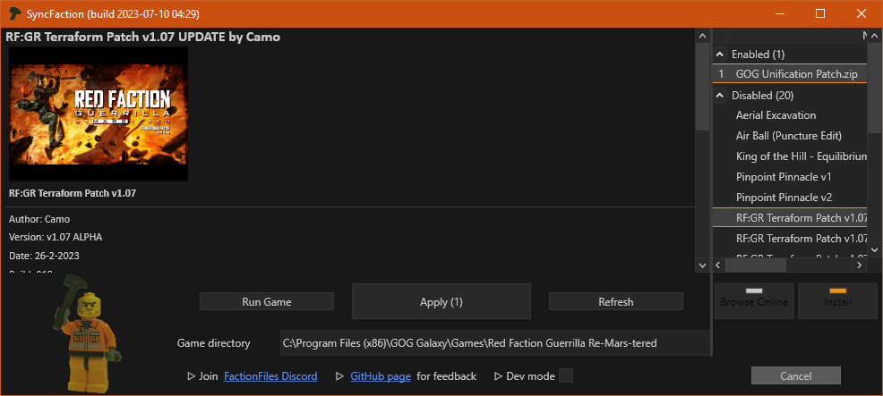

# SyncFaction

Red Faction Guerrilla Re-MARS-tered mod manager with focus on user experience

*Like a multiplayer launcher for any recent game, plus mod support*

## Project goals

* Decent **multiplayer** experience: 1-click update to latest game version and jump into action!
* **ModManager** replacement for **singleplayer** with less bugs and online package management
* Less headaches for users: autoupdates, mod discovery, no manual file management, simplified troubleshooting
* Aid for mod development: documentation, support for multiple kinds of mods. From simple file replacement to resource editing with user inputs

## Installation

Download [latest release](TODO) and place .exe in game folder. That's it!

> You will need at least **20GiB** (TODO measure with terraform rebuild) of free storage space

## Docs

[See docs](TODO) for more details:

* Features
* Non-features
* Getting help
* Tech info

## Credits

Implemented by **rast1234** with support from **moneyl, Camo, Goober, natalie, ATMLVE** and others from FactionFiles community. You people are awesome, bringing life to my favourite game! <3

Red Faction lives on the [Red Faction Community Discord (FactionFiles)](https://discord.gg/factionfiles). Join today!
