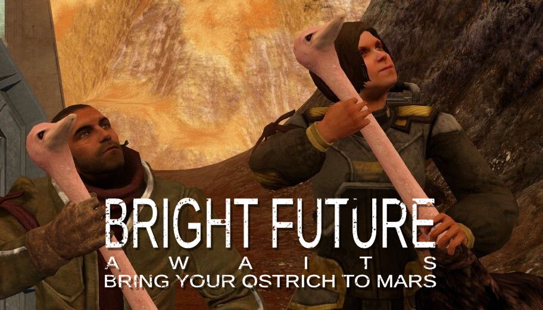
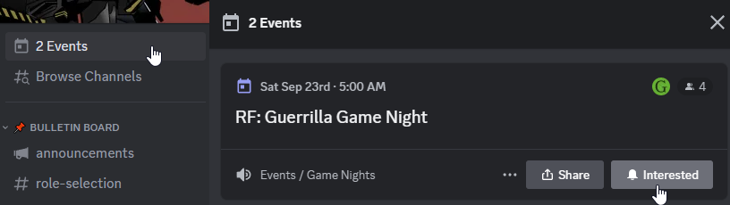

## Introduction for new players

## Is multiplayer alive?

> **Yes, it is!**

We have regular parties once a week. Things to know if you want to join:

## Short HOWTO

* You need RFG Re-mars-tered. GOG or Steam, clean install without mods
* Download [SyncFaction](https://github.com/rfg-modding/SyncFaction/releases) and place it in the game folder
* Run and let it update your game. You will need at least **40GiB** of free storage space and some time to download patches
* Meanwhile, join [FactionFiles Discord](https://discord.gg/factionfiles), see server events for upcoming RFG Game Night and select RFG Multiplayer role in `#role-selection` channel to receive pings
* Want to use mods AND play multiplayer? Roll back to unpatched version of the game? SyncFaction lets you switch between versions in 1 click, see [Usage](usage.md)
* Please ALWAYS run RFG with **[Run Game]** button in SyncFaction

## More detailed guide

<code>Expand</code>

### Community Patch

You'll need to install community-made patches to play. Download size is several gigabytes so please take some time to prepare.

> You will need at least **40GiB** of free storage space

Use [SyncFaction app](https://github.com/rfg-modding/SyncFaction/releases). It is made to keep players updated and simplify process as much as possible. Download and place .exe in game folder. Run it and let it do the thing.

Why do we need patches and a launcher app?

* [Terraform Patch](https://github.com/CamoRF/Red-Faction-Guerrilla-Terraform-Patch) adds new maps, weapons, rebalance, fixes game crashes and bugs (you can find kilometer-long changelog in description). It also serves as a base for future modding by restructuring some resources
* [Reconstructor](https://github.com/rfg-modding/Reconstructor) is a script loader and a game engine patcher. It fixes some crashes, bugs like hardcoded memory limits, and enables scripting in mods
* RFG is not modding-friendly game. Players will crash if their game files are not the same, that's why we need something to keep everyone updated
* There is no simple way to auto-download new maps as in other games. Currently they are part of the patch and we release updates to add more
* Multiplayer is currently broken in GOG version of the game, we fixed that

### FactionFiles Discord

Join [Red Faction Community Discord (FactionFiles)](https://discord.gg/factionfiles)

* In `#role-selection` channel select role `RF:G Players (PC)`. This way you'll be notified when somebody gathers people for multiplayer!
* See server events (above channel list). Subscribe to `RF: Guerrilla Game Night` - you'll get a notification when it starts

Feel free to ask for advice in `#rfg-matchmaking` and `#redfactionguerrilla` channels. Also you can hang out with us in one of the voice channels during game night!

We used to have 2 weekly events: one in American timezone, another for Europe. If current time isn't good for you, let's schedule a new event!

