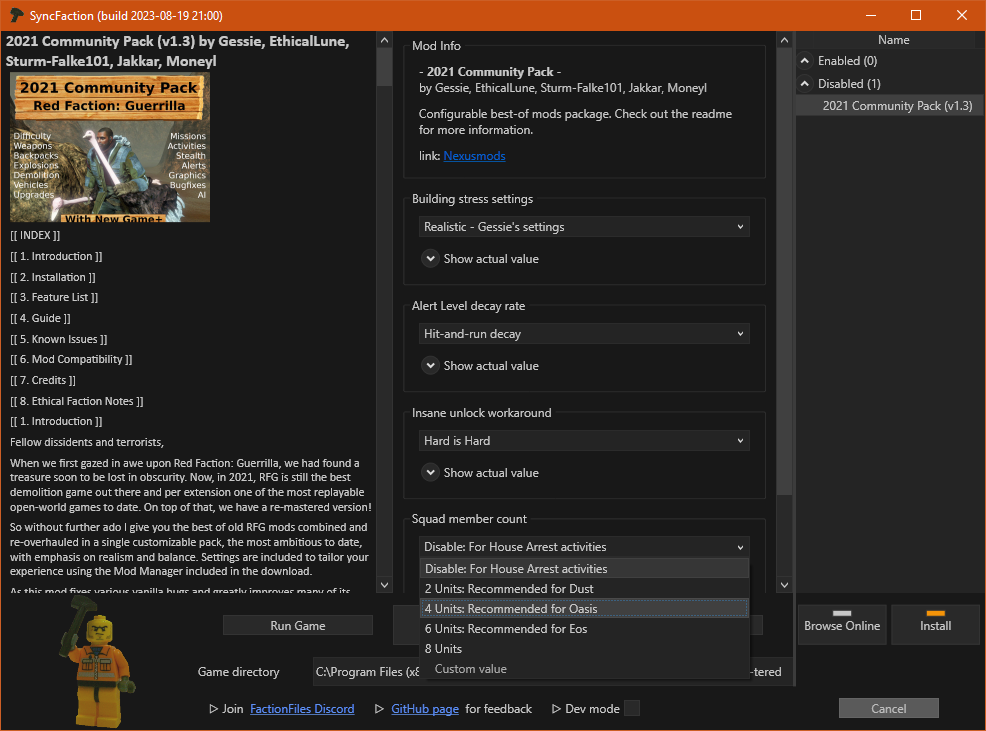

# ModInfo.xml

Basic idea is that we want to edit/replace **certain parts** of XML file. You have to specify what exactly you want to edit and what your change is (removal, replacement, addition, etc). Optionally you can make a list of similar replacements with different values and **let user select one** of them. This feature is also useful for **file replacements** inside `.vpp_pc` archives: you provide several files, user picks one to be copied into the archive.

This is not a comprehensive tutorial! SF documentation only aims to list all features for reference. [This old guide](https://steamcommunity.com/sharedfiles/filedetails/?id=232833017) can be somewhat useful as a start, but doesn't give enough details. Best way to learn it is to see how existing `modinfo.xml` files are done:

* [2021 Community Pack](https://www.factionfiles.com/ff.php?action=file&id=5746) is a good start with comments and has different actions
* [ Jetpack Upgrade Fix](https://www.factionfiles.com/ff.php?action=file&id=4812) is a short and simple example
* [Vehicle Camera Options](https://www.factionfiles.com/ff.php?action=file&id=6232) has comprehensive user inputs and edits
* [Sector Color Selector](https://www.nexusmods.com/redfactionguerrillaremarstered/mods/5) has smart recursion

> HELP WANTED: new guides and examples on how to write `modinfo.xml` are welcome!

## XML Structure

ModInfo consists of following nodes:

* no XML header!
* `<Mod name="example">` on the root level, everything else is inside it
* `<Author>test</Author>`
* `<Description>what this mod does</Description>`
* `<WebLink Name="github">https://github.com/rfg-modding/SyncFaction</WebLink>`
* `<Changes>`: list of actions to be performed on game files
* `<UserInput>`: list of data to allow user make some choices and then use selected values in `<Changes>`

There are 2 types of `Changes`: `<Edit>` and `<Replace>`.

There is 1 type of `UserInput`: `ListBox`.

### Replace

```xml
<Replace File="data\misc.vpp_pc\camera.xtbl" NewFile="replacements\camera.xtbl" />
<Replace FileUserInput="input_name" NewFile="replacements\camera.xtbl" />
<Replace File="data\misc.vpp_pc\camera.xtbl" NewFileUserInput="input_name" />
<Replace FileUserInput="input_name1" NewFileUserInput="input_name2" />
```

This type of change works with any files inside `.vpp_pc` archives and allows you to replace a file with new one. File names can be hard-coded into `File` and `NewFile` attributes, or reference user-selected value from input by input's name: `FileUserInput`, `NewFileUserInput`. This is useful when you want to provide different options to choose from.

### Edit

```xml
<Edit File="data\misc.vpp_pc\camera.xtbl">...</Edit>
<Edit File="data\misc.vpp_pc\camera.xtbl" LIST_ACTION="ADD">...xml...</Edit>
<Edit File="data\misc.vpp_pc\camera.xtbl" LIST_ACTION="ADD_NEW">...xml...</Edit>
<Edit File="data\misc.vpp_pc\camera.xtbl" LIST_ACTION="REPLACE">...xml...</Edit>
<Edit File="data\misc.vpp_pc\camera.xtbl" LIST_ACTION="COMBINE_BY_FIELD:Foo">...xml...</Edit>
<Edit File="data\misc.vpp_pc\camera.xtbl" LIST_ACTION="COMBINE_BY_FIELD:Foo,Bar">...xml...</Edit>
```

This type of change works with XML contents of `.xtbl .dtdox .gtodx` files. `File` attribute specifies file to edit. Optional `LIST_ACTION` attribute controls how to merge lists of nodes. Basically, algorithm takes xml structure inside `<Edit>` and descends into corresponding xml structure of game file, selecting same tags. When you want to add/replace/merge certain nodes, you have to specify `LIST_ACTION` on parent level. This is hard to describe, see examples and check out existing mods.

> Edits are applied sequentially so they can be recursive: you apply first Edit, then second will run on top of first Edit's results

### LIST_ACTION ADD

This is default `LIST_ACTION` value when nothing is specified on `<Edit>` node.

When specified on a node in `modinfo.xml`, takes all child nodes and appends them to the same parent in game file

### LIST_ACTION ADD_NEW

This is default `LIST_ACTION` value when nothing is specified on any node inside `<Edit>`.

When specified on a node in `modinfo.xml`, takes all child nodes and appends **only new ones** to the same parent in game file. Child nodes that already exist are merged normally.

### LIST_ACTION REPLACE

When specified on a node in `modinfo.xml`, takes all child nodes and replaces contents of same parent in game file with these nodes

### LIST_ACTION COMBINE_BY_FIELD

This attribute has a value: comma-separated list of node names to match, eg. `LIST_ACTION="COMBINE_BY_FIELD:Foo,Bar`

When specified on a node in `modinfo.xml`, for each child node, looks inside same parent in game file for subnodes with specified names, eg. both `<Foo>` and `<Bar>` must be somewhere inside child node, on any depth level. If child node has a match, it is merged normally. If not, it is added to the parent in game file, like in `ADD`.

### UserInput

Currently there is only one type of inputs: ListBox.

```xml
<UserInput>
    <ListBox Name="inputName" DisplayName="User-friendly name">
        <Option Name="User-friendly option name 1">
            ...xml...
        </Option>
        <Option Name="User-friendly option name 2">
            ...xml...
        </Option>
    </ListBox>
<UserInput>
```

Each `<Option>` can have arbitrary XML content and it will be substituted when its `<ListBox>` is referenced anywhere in `<Changes>` as `<USER_INPUT>inputName</USER_INPUT>`.

```xml
<Changes>
    <USER_INPUT>inputName1</USER_INPUT>
    <Edit File="data/misc.vpp/tweak_table.xtbl">
        <Tweak_Table_Entry>
            <Name>Camera_vehicle_fov</Name>
            <Value><USER_INPUT>inputName2</USER_INPUT></Value>
        </Tweak_Table_Entry>
    </Edit>
    <Edit File="data/misc.vpp/vehicles.xtbl">
        <USER_INPUT>inputName3</USER_INPUT>
		<USER_INPUT>inputName4</USER_INPUT>
    </Edit>
</Changes>
```

> Inputs can be recursive and even reference other Inputs or Changes/Edits/Replaces: they are substituted sequentially before any action is performed so you can build your Change list based on user selection

Here's how inputs look in SF:



Note that there is an option to enter custom value (the last one). If you keep your Options simple enough, eg. `<Option Name="123">123</Option>` and use them accordingly in Changes, users can experiment and enter custom values. Of course they can do it even if your Options have XML structure, but it's not very convenient.

Selected values are saved in SF settings and will be restored automatically every time when mod settings panel is displayed. Also there's an option to reset all inputs for a mod.

## Caveats

### XML Formatting

RFG may crash or behave weirdly if you change XML files **and change formatting** to something other than it was. If you are replacing a block of XML, try to adhere to its original formatting even if it makes no sense. Also, validate how it merges into game file.

### Directories

Place your modinfo.xml and all corresponding files in a subfolder of your mod, like in examples! This way SF will not confuse it with regular files to be copied to game folder.

The only important thing here is the `modinfo.xml` file name. Other files and directories can be named any way you like.

```
📦 free_weapons.zip  // ✅
|-📂 modinfo_directory
  |-📄 modinfo.xml
  |-📂 replacement_files
    |-📄 free_weapons.xtbl

📦 free_weapons.zip  // ❌
|-📂 modinfo_directory
  |-📄 modinfo.xml
  |-📄 free_weapons.xtbl

📦 free_weapons.zip  // ❌
|-📄 modinfo.xml
|-📂 replacement_files
  |-📄 free_weapons.xtbl

📦 free_weapons.zip  // ❌
|-📄 modinfo.xml
|-📄 free_weapons.xtbl
```

### Misc and Table

If you edit contents of `misc.vpp_pc`, do the same for `table.vpp_pc` and vice versa. This is weird but that's how the game works.

### Legacy

ModManager had support for more LIST_ACTIONs:

* `COMBINE_BY_TEXT`, apparently to match nodes based on their text contents
* `COMBINE_BY_INDEX`, apperently to match nodes based on their position under parent
* `COMBINE_BY_ATTRIBYTE:foo,bar`, apparently to match by attribute names or values

Also it probably allowed to control if attributes of a certain node should be copied.

> In 139 mods from FF, Nexus and ModDb i was unable to find even a single mod using any of that!

Probably because these features were not documented anywhere. If you have a use-case for something like that, create an issue and describe what you are trying to achieve.

---

## Example: Replace a File

Here we replace single file inside an archive. This can be achieved with loose archives too. What's the point then? In this oversimplified example we don't have inputs, but idea is to provide user-friendly way to customize mod behavior.

```
📦 test_op_sledgehammer_mod.zip
|-📂 test_modinfo
  |-📄 modinfo.xml
  |-📂 test_replacements
    |-📄 test_melee_more_damage.xtbl
```

<details>
<summary><code>modinfo.xml</code></summary>

```xml
<Mod Name="example">
    <Author>test</Author>
    <Description>what this mod does</Description>
    <WebLink Name="github">https://github.com/rfg-modding/SyncFaction</WebLink>
    <!-- this modinfo has no user inputs -->
    <Changes>
        <!-- here we edit misc.vpp_pc and replace melee.xtbl with our version -->
        <Replace File="data\misc.vpp_pc\melee.xtbl" NewFile="test_replacements\test_melee_more_damage.xtbl" />
    </Changes>
</Mod>
```

</details>

---

## Example: Edit XML

Here we edit single XML file to make sledgehammer upgrade free and remote charges upgrade to 12 instantly. This example is based on [All Upgrades](https://www.factionfiles.com/ff.php?action=file&id=4811) mod.

```
📦 mod.zip
|-📂 modinfo_test
  |-📄 modinfo.xml
```

<details>
<summary><code>modinfo.xml</code></summary>

```xml
<Mod Name="example">
    <Author>test</Author>
    <Description>what this mod does</Description>
    <WebLink Name="github">https://github.com/rfg-modding/SyncFaction</WebLink>
    <!-- this modinfo has no user inputs -->
    <Changes>
        <Edit File="data\table.vpp_pc\upgrades.xtbl" LIST_ACTION="COMBINE_BY_FIELD:Name">
            <Upgrade>
                <Name>sledgehammer</Name>
                <Levels LIST_ACTION="COMBINE_BY_FIELD:Value">
                    <Level>
                        <Cost>0</Cost>
                        <Value>1</Value>
                    </Level>
                </Levels>
            </Upgrade>
            <Upgrade>
                <Name>remote_charge_count</Name>
                <Levels LIST_ACTION="COMBINE_BY_FIELD:Description">
                    <Level>
                        <Description>UPG_CHARGES_3</Description>
                        <Cost>0</Cost>
                        <Value>12</Value>
                    </Level>
                </Levels>
            </Upgrade>
        </Edit>
    </Changes>
</Mod>
```

</details>

<details>
<summary><code>upgrades.xtbl</code> from the game (relevant part, formatted for readability)</summary>

```xml
<root>
    <Table>
        <Upgrade>
            <Name>sledgehammer</Name>
            <Type>Weapon Upgrade</Type>
            <Levels>
                <Level>
                    <Cost>0</Cost>
                    <Value>0</Value>
                    <Available>True</Available>
                    <Show_Locked>False</Show_Locked>
                    <Unlock_Action>Unlocked</Unlock_Action>
                    <Also_Unlock_Level>1</Also_Unlock_Level>
                    <Activity_Count>0</Activity_Count>
                </Level>
                <Level>
                    <Description>WEAP_SLEDGE</Description>
                    <Cost>25</Cost>
                    <Value>1</Value>
                    <Available>True</Available>
                    <Show_Locked>False</Show_Locked>
                    <Unlock_Action>Unlocked</Unlock_Action>
                    <Also_Unlock_Level>1</Also_Unlock_Level>
                    <Upgrade_Name>WEAP_SLEDGE</Upgrade_Name>
                    <Activity_Count>0</Activity_Count>
                </Level>
            </Levels>
            <_Editor>
                <Category>Normal</Category>
            </_Editor>
            <Display_Name>WEAP_SLEDGE</Display_Name>
            <Icon_Image>ui_hud_weapon_icon_hammer</Icon_Image>
            <Blueprint>ui_blueprint_hammer</Blueprint>
            <Weapon>sledgehammer</Weapon>
        </Upgrade>
        <!-- original file has more Upgrades here -->
        <Upgrade>
            <Name>remote_charge_count</Name>
            <Type>Weapon Upgrade</Type>
            <Levels>
                <Level>
                    <Description>UPG_CHARGES_3</Description>
                    <Cost>50</Cost>
                    <Value>3</Value>
                    <Available>True</Available>
                    <Also_Unlock_Level>1</Also_Unlock_Level>
                    <Unlock_Action>Unlocked</Unlock_Action>
                    <Show_Locked>False</Show_Locked>
                    <Upgrade_Name>UPG_CHARGES_COUNT_NAME</Upgrade_Name>
                    <Activity_Count>0</Activity_Count>
                </Level>
                <!-- original file has more Levels here -->
            </Levels>
            <_Editor>
                <Category>Normal</Category>
            </_Editor>
            <Display_Name>UPG_CHARGES_COUNT_NAME</Display_Name>
            <Icon_Image>ui_hud_weapon_icon_charges</Icon_Image>
            <Blueprint>ui_blueprint_deploy_remotemines</Blueprint>
            <Weapon>charge_placer</Weapon>
        </Upgrade>
        <!-- original file has more Upgrades here -->
    </Table>
</root>
```

</details>

What happens here, step by step:

| Operation | `modinfo.xml` | `upgrades.xtbl` |
|-|-|-|
| 1. Iterate over `<Changes>`. We have only one | `<Changes>` | |
| 2. The change is an `<Edit>`. Open `upgrades.xtbl` from `misc.vpp_pc` as XML and iterate over nodes inside `root.Table` | `<Edit File="data\misc.vpp\upgrades.xtbl">` | `<root><Table>...</Table></root>` |
| 3. This tells how to merge node list: by looking at `<Name>` nodes. Remember it | `LIST_ACTION="COMBINE_BY_FIELD:Name"` | |
| 4. Iterate over nodes inside `<Edit>`, one by one. We have two `<Upgrade>` nodes | `<Edit><Upgrade><Upgrade>...</Edit>` | |
| 5. Let's work with first `<Upgrade>`. We are looking for a structure in `root.Table` where `Upgrade.Name` is `sledgehammer`. Why? See `COMBINE_BY_FIELD` above! | `<Upgrade><Name>sledgehammer</Name></Upgrade>` | `<Upgrade>` `<Name>sledgehammer</Name>` `<Type>Weapon Upgrade</Type>` `<Levels>` ... `</Upgrade>` |
| 6. When found, now we look what's inside | `<Levels>` | `<Levels>` |
| 7. This tells how to merge node list: by looking at `<Value>` nodes. Remember it | `LIST_ACTION="COMBINE_BY_FIELD:Value"` | |
| 8. Iterate over nodes inside `<Levels>`, one by one. We have one `<Level>` node | `<Levels><Level></Levels>` | |
| 9. Let's work with the `<Level>`. We are looking for a structure in `Upgrade.Levels` where `Level.Value` is `1`. Why? See `COMBINE_BY_FIELD` above! | `<Level><Cost>0</Cost><Value>1</Value></Level>` | `<Level>` `<Description>WEAP_SLEDGE</Description>` `<Cost>25</Cost>` `<Value>1</Value>` `<Available>True</Available>` ... `</Level>` |
| 19. When found, there are no instructions to merge lists so we just replace relevant nodes: from modinfo to game file. We only have to replace `<Cost>` and `<Value>` nodes | `<Cost>0</Cost><Value>1</Value>` | `<Description>WEAP_SLEDGE</Description>` `<Cost>0</Cost>` `<Value>1</Value>` `<Available>True</Available>` ... |

Second `<Upgrade>` looks for `Upgrade.Name` == `remote_charge_count`. Then it looks for `Level.Description` == `UPG_CHARGES_3` and replaces nodes there. If you want to understand, read carefully, probably open both files side by side. Process should be more or less clear after this.